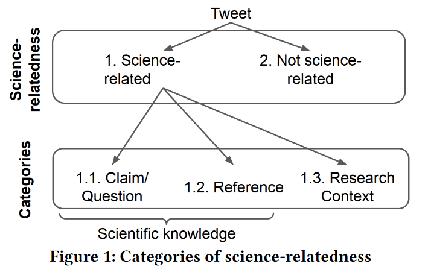

# SciTweets Classifier - Classification of Science-Relatedness of Tweets

## Description
This repository contains a script to classify the science-relatedness of Tweets. The underlying classifier was trained as part of *"SciTweets - A Dataset and Annotation Framework for Detecting Scientific Online Discourse"* published at **CIKM2022**. The classifier distinguishes three different forms of science-relatedness for Tweets:


The three categories of science-relatedness that the classifier predicts (categories 1.1, 1.2, and 1.3) are defined as:

**Category 1 - Science-related**: Texts that fall under at least one of
the following categories:

&nbsp;&nbsp;&nbsp;&nbsp;&nbsp;&nbsp;**Category 1.1 - Scientific knowledge (scientifically verifiable claims)**: Does the text include a claim or a question that
could be scientifically verified? 

&nbsp;&nbsp;&nbsp;&nbsp;&nbsp;&nbsp;**Category 1.2 - Reference to scientific knowledge**: Does
the text include at least one reference to scientific knowledge?
References can either be direct, e.g., DOI, title of a paper or
indirect, e.g., a link to an article that includes a direct reference

&nbsp;&nbsp;&nbsp;&nbsp;&nbsp;&nbsp;**Category 1.3 - Related to scientific research in general**:
Does the text mention a scientific research context (e.g., mention
of a scientist, scientific research efforts, research findings)? 

**Category 2 - Not science-related**: Texts that don’t fall under
either of the 3 previous categories. 


## Keywords
Science-Relatedness, Scientific Online Discourse, Tweets, Claims


## Use Cases
1. A social scientist wants to analyze scientific online discourse and needs to extract such data from a list of existing tweet texts.
2. A social scientist wants to identify scientific claims in Tweets. 
3. A social scientists wants to identify scientific references in Tweets.


## Repo Structure
This repository contains the following files:

├── **classify.py** the python script for classifying the science-relatedness of Tweets <br />
├── **example_tweets.tsv** an exemplary dataset in tsv format (tab separated) 


## Setup


### Environment Setup
To run the classifier the following software is required. 

First, the script requires a Python environment with a version >= 3.9
1. Python >= 3.9

Second, within the Python environment, install the modules from **requirements.txt** with

    python -m pip install -r requirements.txt

Note, the script might also run properly with different versions of the modules. 

### Hardware Requirements (Optional)
The classifier does not require specific hardware. When running the classification script **classify.py** for the first time, a network connection is required to download the underlying classifier. A GPU is not required but can speed up the classification, especially for larger collections of input Tweets.
    
# Input Data
The input data has to be a .tsv file (tab separated) containing the Tweets to classify. The input file needs to have a _text_ column. Optionally, if the input file has a _urls_ column, the **classify.py** script will exchange the urls in the text in the _text_ column with the urls from the _urls_ column.
For example, in the last Tweet in **example_tweets.tsv** the text 

    "Vestislav Apostolov, David M. J. Calderbank, Eveline Legendre: Weighted K-stability of polarized varieties and extremality of Sasaki manifolds https://t.co/wd6l9ARN21 https://t.co/rwzu51tW32" 

will be updated based on the information in the _urls_ column 

    "['https://arxiv.org/abs/2012.08628', 'https://arxiv.org/pdf/2012.08628']" 

to 

    "Vestislav Apostolov, David M. J. Calderbank, Eveline Legendre: Weighted K-stability of polarized varieties and extremality of Sasaki manifolds https://arxiv.org/abs/2012.08628 https://arxiv.org/pdf/2012.08628"

which can improve the classifier's performance. All other columns in the input file will not be used by the classifier and will stay the same in the output file.


## Sample Input and Output Data
The file **example_tweets.tsv** contains exemplary input data. After running **classifier.py** a new file will be created that contains the input data and three additional columns, one for each category, including the output scores of the classifier. The scores range from 0 to 1. 

Structure of the input file:

tweetid&emsp;&nbsp;&nbsp;text&emsp;urls
<br>
...&emsp;&emsp;&emsp;&emsp;...&emsp;&nbsp;&nbsp;&nbsp;...
<br>
...&emsp;&emsp;&emsp;&emsp;...&emsp;&nbsp;&nbsp;&nbsp;...


Structure of the output file:

tweetid&emsp;&nbsp;&nbsp;text&emsp;urls&emsp;cat1_score&emsp;cat2_score&emsp;cat3_score
<br>
...&emsp;&emsp;&emsp;&emsp;...&emsp;&nbsp;&nbsp;&nbsp;...&emsp;&nbsp;&nbsp;&nbsp;...&emsp;&emsp;&emsp;&emsp;&nbsp;&nbsp;&nbsp;...&emsp;&emsp;&emsp;&emsp;&emsp;&nbsp;...
<br>
...&emsp;&emsp;&emsp;&emsp;...&emsp;&nbsp;&nbsp;&nbsp;...&emsp;&nbsp;&nbsp;&nbsp;...&emsp;&emsp;&emsp;&emsp;&nbsp;&nbsp;&nbsp;...&emsp;&emsp;&emsp;&emsp;&emsp;&nbsp;...


# How to Use
1. Install required software and modules
2. Run the classifier with:
    
    
    python3 classifier.py _input_file_path_

where the _input_file_path_ is the path on your computer/server where the input file is located.
3. After the classifier is finished it will save the output file to the same location as the _input_file_path_ with "_pred" appended to the input file filename.

# Contact Details
For questions or feedback, contact sebastian.schellhammer@gesis.org

# Publication
Please cite the following paper if you are using the classifier:

*Hafid, Salim, et al. "SciTweets-A Dataset and Annotation Framework for Detecting Scientific Online Discourse." Proceedings of the 31st ACM International Conference on Information & Knowledge Management. 2022, [download](https://arxiv.org/abs/2206.07360).*

```bib
@inproceedings{hafid2022scitweets,
  title={SciTweets-A Dataset and Annotation Framework for Detecting Scientific Online Discourse},
  author={Hafid, Salim and Schellhammer, Sebastian and Bringay, Sandra and Todorov, Konstantin and Dietze, Stefan},
  booktitle={Proceedings of the 31st ACM International Conference on Information \& Knowledge Management},
  pages={3988--3992},
  year={2022}
}
```